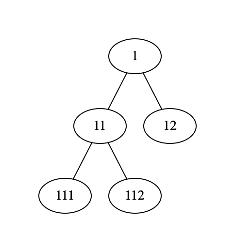

# Exercise 4, Advanced Programming in Python

Chalmers DAT515

Aarne Ranta

2021-12-01

## Question 1

(Easy question, from an old Python Introduction exam.)
Your task is to implement a simple class for bank accounts. The class keeps track of two things:
- the account number, which is set when the account is created, and never changes,
- the account balance, which starts with an initial amount, and changes when money is transferred between accounts

Complete the `Account` class definition, initialization, and the two methods by filling in what is missing from the code below:
```
    class Account:
        # an account has a number and a balance

        def get_balance(self):
            # return the actual balance

        def set_balance(self, b):
            # change the balance to b
    
    
    def transfer(account1,account2,amount):
        # transfer amount from account1 to account2
        # report "OK" if successful, i.e. account1 has the required amount
        # "not enough money" otherwise
```
Also complete the `transfer()` for making transfers between accounts.
The function must check that there is enough money in the account from which money is taken. 


## Question 2

In Lecture 6, we defined a class ``Tree`` as a subclass of ``Graph``.
The complete code is in
  
  [trees.py](../../examples/trees.py)

from which you should import everything when solving this question and the next one.

Then we had to be careful with the ``add_edge()`` method to guarantee that the objects of this class really were valid trees.
An alternative definition of trees is completely different: it defines trees as a **recursive** data structure, where a tree is constructed from a root node and a list of its subtrees - which in turn need to be trees.
In addition to ``__init__()``, it is then useful to export the method ``parts()``, which extracts the root and the subtrees:
```
    class RecTree:
        def __init__(self, r, ts):
            self._root = r
            self._subtrees = ts

        def parts(self):
            return self._root, self._subtrees
```
To make it easier to define trees, we also want to have a function ``atom()``, which constructs a tree with no subtrees, to be used for the leaves of the tree:
Here is an example of a ``RecTree``:
```
    extree = RecTree(1, [RecTree(11, [atom(111), atom(112)]), atom(12)]) 
```
visualized



Your task is now to define
```
    # methods of RecTree

        # a list of edges from which a Graph can be constructed  
        def edges(self):

        # conversion to the Tree class of Lecture 6
        def to_tree(self):


    # a helper function to construct atomic trees
    def atom(a):  
```
To test this, you should run
```
    if __name__ == '__main__':
        visualize(extree.to_tree())
```
which uses the `visualize()` function defined in Lecture 6.


## Question 3

The ``RecTree`` class of Question 2 has one clear advantage over ``trees.Tree``: you can use the same node in different places in the tree.
This is common for instance in **syntax trees**, where the expression ``2 + 2`` can be represented as
```
    RecTree('+', [atom('2'), atom('2')]) 
```
The ``to_tree()`` method of Question 3 could not convert this to a valid ``trees.Tree``.
But there is an alternative method that can be used:
```
        # conversion to the ValTree class of Lecture 6
        def to_valtree(self):
```
The idea is to convert the nodes of ``RecTree`` into **values** in the ``ValTree``, whereas the vartices are generated by a unique numbering.

The proper visualization of the resulting tree will then show the values rather than the vertices, which is another thing you can implemente. 


## Question 4

Define a class ``Fun`` that supports **function composition** via overloading of multiplication.
The general equation for function composition is
```
  (g * f)(x) = g(f(x))
```
Test your solution by running the following script,which shows expected results together with results from your solution:
```
if __name__ == '__main__':
    f = Fun(lambda x: x+1)
    g = Fun(lambda x: 3*x)

    print(9, f(8))
    print(24, g(8))
    print()
    print(27, (g*f)(8))
    print(30, (g*f*f)(8))
    print(81, (g*g*f)(8))
    print(28, (f*g*f)(8))
```
