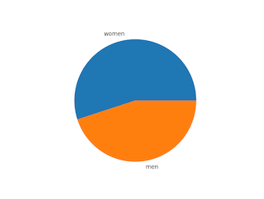

# Exercise 6, Advanced Programming in Python

Chalmers DAT515

Aarne Ranta

2021-12-15

This exercise simulates the situation where we have to organize the exam on-line.
In that situation, you will have access to all resources on your computer, including the internet.
Thus the situation will be similar to whenever you are programming.
You are not only allowed to use the internet resources: you must do it as a part of the problems you solve.
There is one difference, however:

*You will not be allowed to communicate with any other person during the exam, not even your lab partner!*

There is also a difference in comparison to many other exams: this time,

*Your Python code can import any libraries that belong to Python standard libraries or can be installed with pip.*

The likely scenario is still, at the time of writing, that we will have exam on the campus.
In that case, the questions will be of a totally different kind: you will not need to write lengthy code on paper, but only to answer questions where short answers are expected.
That scenario will be simulated in a quiz on the last lecture, 16 December.

In either case, this exam is designed to test the main learning outcomes of this course and serve as a repetition of some of the contents.

To pass the exam, you will need 15 points of the maximum 30.
The actual grade (3, 4, 5) is determined by your lab work and not by this exam.


## Question 1 (14p)

WikiData is a source for facts underlying the Wikipedia.
Technically, it is a graph database consisting of RGF triples.
But this is not something you need to know about when solving the problems in this exercise session.
Instead, you can fetch data in the JSON format and use it as input to your code.

You will start with a query that builds a table of Nobel prize winners.
We have prefabricated this query and downloaded the results in the file

[nobel.json](./nobel.json)

(The original source with all details can be found in https://w.wiki/3tEM but you do not need to go there: it is much faster to use the local JSON file.)

Your task is to write a Python program that reads this JSON file and writes another one, which presents some statistics about Nobel prize winners.
It should include

- as keys, `awardLabel` i.e. the category such as Physics, Literature
- as values, dictionaries with
    - `percentageWomen`: how many percent (rounded to nearest integers) of persons in this category have the `sexLabel` "female"
    - `averageAge`: the average age (in full years, rounded) in which a person in this category won the price; this is computed as the difference between the year in `birthDate` and `date`, where it is enough to consider the year part of the date, without taking months and days into account

The output file should be entitled `nobel-statistics.json`.
You answer should include

- this JSON file
- the Python code used for producing it


## Question 2 (8p)

Write a function that takes a distribution (a set of labels and their percentages) and returns a visualized **pie chart**, such as



Write another function that applies the pie chart function on data from Question 1 and produces the following pie charts:

- for each Nobel prize category, the distribution of women and men

Your answer should include

- the saved pie chart images
- the Python code that produces it


## Question 3 (8p)

An undirected graph is **complete** if, for every vertex *a* has an edge to every vertex *b* that is not *a* itself.

Using the definition of graphs from you Lab 2, write a function `complete(G)` that tests whether a give graph `G` is complete.

Deciding completeness in this way can be expensive (quadratic in the number of vertices), and there is actually an easier way: the number of edges should be

*n(n-1)/2*

where *n* is the number of vertices.
In the simplest case, you can just use
```
    def easy_complete(G):
        n = len(G.vertices())
        return len(G.edges()) == (n*(n-1)) // 2
```
However, the correctness of this function depends on how your class of graphs is defined.
Write a test that compares this definition with the original `complete()` function by generating random graphs and testing then.
If you find counter-examples, there are three possible sources of them: the two functions in this question plus your Graph class itself.
Study the counter-examples and give your own explanation.
You do not need to fix your Graph class now even if the problem is there.


