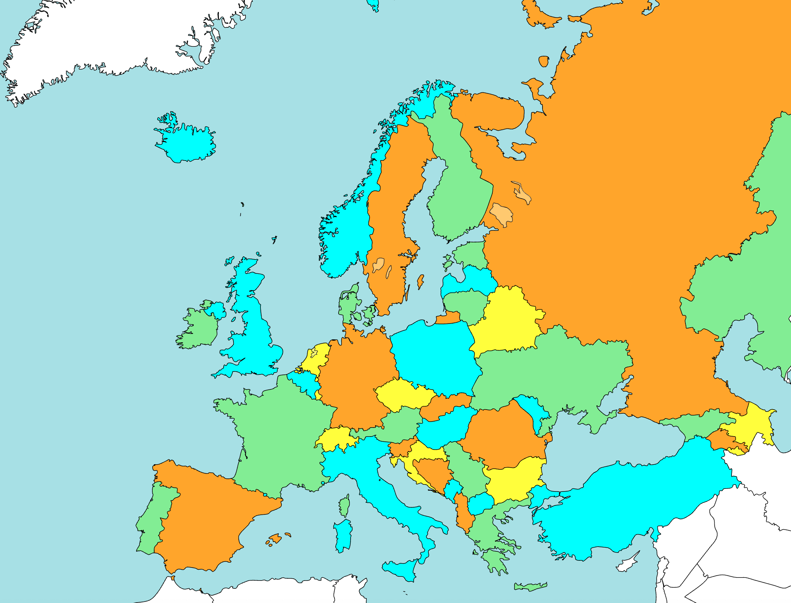
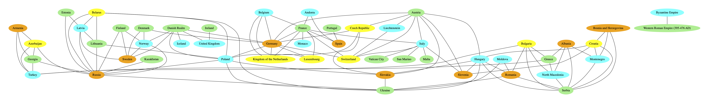
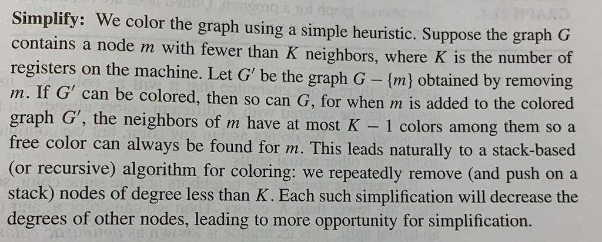
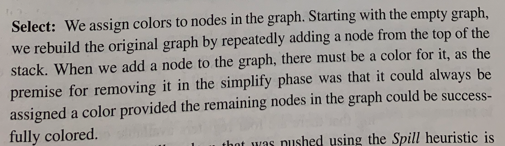
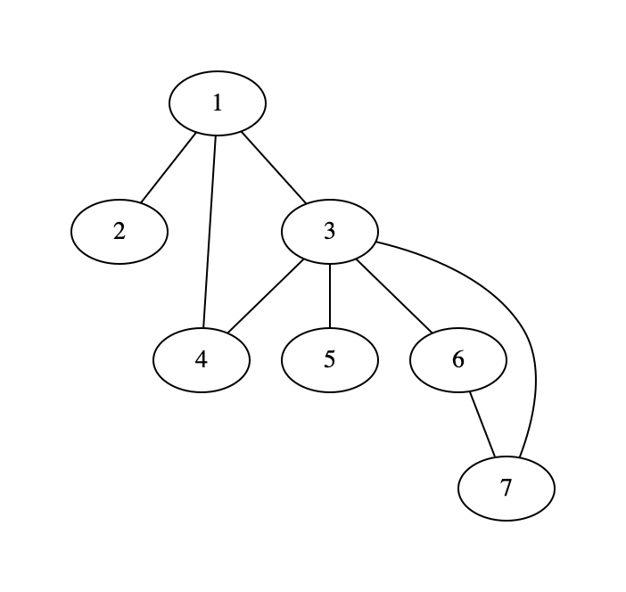

# Extra Lab 1: Graph Colouring

Advanced Python Course, Chalmers DAT515, 2021

by Aarne Ranta

Version 1.0, 17 December 2021.

*This is an extra lab, thus not compulsory.*
*But it gives an opportunity to gain a higher grade.*
*It has Part 1, which gives 6 points, and Part 2, 4 points.*
*The limit is 50 points in total for grade 5, 40 points for grade 4.* 
*Thus, for instance, doing Part 1 of this lab is sufficient for grade 5, if you have done all bonus parts of the ordinary labs.*


## The problem

The problem of graph colouring is to assign colours to the vertices of a graph so that adjacent vertices always have different colours.
A famous mathematical result is the **Four-Colour Theorem**, stating that every planary graph (graph where no edges intersect) can be coloured with just four colours.

An application is colouring of geographical maps, so that neighbouring regions (such as countries) always have different colours.
By the Four-Colour Theorem, four different colours are possible for this.
As a demonstration of the current lab, we offer the map of Europe as an example of this.
Four instance, Germany has ten neighbours and one of them, France, has nine, but our algorithm will still be able to colour the map with four colours:



The underlying graph is more explicitly seen in this picture:



### For those interested (not covered in this lab)

Another application is **register allocation** in compilers.
The task there is to decide which variables are to be stored in the registers of the CPU, where they are much faster to manipulate than in the memory.
Since the number of registers is very limited, this becomes quickly an issue for programs that may need to store the values of hundreds or thousands of variables.
The graph representation of the problem creates vertices for each variable.
Edges are drawn between variables that are "live" at the same time, i.e. whose values can be needed at the same time.
This means that they cannot be stored in the same register.
Now, representing registers as colours reduces the register allocation problem to graph colouring.

The program analysis methods that are needed to encode the register allocation problem is beyond this course, so this application is not included in the lab.
But it is nice to know that the methods implemented here - like many other graph algorithms - can have widely different applications.


## The task, Part 1: the algorithm (6 points)

Graph colouring in general is an **NP-complete** problem, meaning that it is in a class of problems that can be unfeasible because of their complexity.
The method we are suggesting here is an approximative algorithm that runs in linear time and is the one commonly used for register allocation in compilers.
The description below comes from the book

Andrew Appel, *Modern Compiler Implementation in ML*, Cambridge University Press 1998.

Here is the book's description of the two steps of the algorithm, **simplify** and **select**:





As an example, let us go through the steps of achieving the colouring of the following graph with three colours:



1. remove 2
2. remove 4
3. remove 5
4. remove 6
5. remove 7
6. remove 1
7. remove 3
8. add 3 blue
9. add 1 green
10. add 7 green
11. add 6 red
12. add 5 green
13. add 4 red
14. add 2 blue

The result is


Steps 1 to 7 could be taken in a different order, depending on
which of the possible vertices to remove next: the first one could be any of 2,4,5,6,7 which all have less than 2 neighbors.
Steps 8 to 14 must be the exact reverse of 1 to 7, but there is some freedom in selecting colors at many of the steps.

You should test your algorithm with the same example, plus many others.
Do this by appending the following piece of code to your file:
```
    def demo():
        G = gr.Graph([(1,2),(1,3),(1,4),(3,4),(3,5),(3,6), (3,7), (6,7)])
        viz_color_graph(G,['red', 'green', 'blue'])

    if __name__ == '__main__':
        demo()
```
Your submission should be in the file `coloring.py`, which contains at least the following functions:

- `simpify(graph, n=4)` returning the stack of removed vertices, when `n` colours are available;
- `rebuild(graph, stack, colors)` returning a dictionary that for each vertex assigns a color from the list `colors` (e.g. `['red', 'green', 'blue']`);
- `viz__color_graph(graph, colors)`, which combines those two functions and shows a GraphViz image of `graph` coloured with colours from the list `colors`, whose length is passed as `n` to `simplify()`.


### Color vs. colour

You may have noticed that we write "colour" in the text of this document but "color" in Python code.
The reason is that

- the author tries to use British spelling consistently when writing English,
- Python identifiers should use the same language everywhere, which is usually Americal English.

In particular, the Matplotlib and Graphviz libraries, which are heavily used in this course, use the American form `color`.


## The task, Part 2: colouring an SVG map (4 points)

This part presupposes that you have done Part 1.
It applies the algorithm to maps given in the SVG format.
Thus the main part of the problem is to analyse and modify an SVG file so that its colours are changed in accordance with a colouring found by your algorithm.

You code needs to read three files:

- [`whitemap.svg`](file/whitemap.svg), a map of Europe with all countries white;
- [`neighbors.json`](neighbors.json), a list of neighbour-neighbour pairs;
- [`country_codes.json`](file/country_codes.json), a list of country codes and country names.

and write one file:

- `colormap.svg`

These file names should be given as default arguments to the following functions:

- `get_neighbors(codefile=COUNTRY_CODES_FILE, neighborfile=NEIGHBOR_FILE)`, returning dictionaries of country codes and country-neighbour lists,
- `get_map_colors(neighbordict)`, returning a dictionary of colours for the countries in `neighbordict`, using your algorithm from Part 1 of this lab with four colours,
- `color_svg_map((colordict, infile=WHITEMAP_FILE, outfile=COLORMAP_FILE)`, putting everything together and writing a coloured version fo the white map,
- `main()`, called when the program is run as "main", and producing `colormap.svg` from the default source files.

These functions should reside in a file named

- `color_svg_map.py`

The main library that is needed is `xml.etree.ElementTree`, used for analysing and modifying the white map into the coloured map.

### Data sources

The provided data files have been downloaded or extracted from the following sources:

- `whitemap.svg`: https://commons.wikimedia.org/wiki/File:Blank_map_europe_coloured.svg
- `neighbors.json`: https://w.wiki/4EuG
- `country_codes.json`: https://datahub.io/core/country-list

Thus we have started with a coloured map from Wikimedia and made it white.
But here the starting point is the white map, which we colour by our algorithm.


## Submission

As usual, submit via GitHub and Canvas, in a subdirectory `extra-colouring`, the following files:

- `coloring.py` for Part 1,
- `color_svg_map.py` for Part 2.

