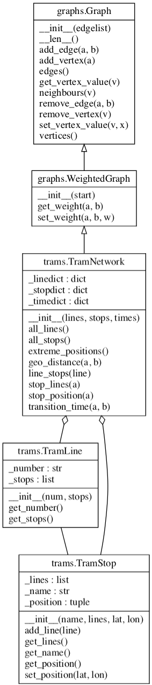

# Lab2: Graphs and transport networks

Advanced Python Course, Chalmers DAT515, 2022

by Aarne Ranta

Version 1.3.1, 1 December 2022

- made it clear that the internal representation of stops and lines in
  TramNetwork can be the dictionary from Lab 1, rather than TramStop
  and TramLine objects

Version 1.3, 30 November 2022

Updated UML diagram, more explanations of the following points (also read the full details in the text below):

- about the values of vertices: they can be e.g. the locations of stops
- about the weights of edges: they can be e.g. transition times between stops
- about native `dijkstra()`: the pseudocode in Wikipedia does not return the paths, but doing that is required, and it is an easy modification of the pseudocode
- about your test file: it is enough that it contains some tests that show that you know how to use Python's test libraries; `hypothesis` is just a recommendation, not a requirement
- about `TramNetwork` class: for the methods listing lines and stops, it is enough to list their names (but listing complete objects is not wrong either)
- about the final demo of `trams.py`: hint that if it works correctly, your code is probably right
- about your Git repository: it should have subdirectories lab1/, lab2/, and lab3/


Version 1.2, 1 December 2021

Modified the test about edge symmetry (`(a, b)` implies `(b, a)`): now about neighbors instead.
Also added a comment on the shortest path test, and on the internal representation in `TramNetwork`.


Version 1.1, 20 November 2021

Left out the method of removing a tram line, since it will probably not be needed in Lab 3.
The paragraph about it has simply been deleted from this document.


Version 1.0, 18 November 2021

Work that satisfies the specification in this version will be
considered valid, even if we have to make changes after Version 1.0. So feel
confident to start you work, but keep an eye on possible changes: we
will not add tasks, but may have to explain some things more clearly.

## Purpose

The purpose of this lab is to build a system of classes and algorithms for graphs.
The intended application is transport networks, which will be built on top of the graph classes.
But the graphs can be applied in many other ways as well, as will be shown in exercises and extra labs.

The main learning outcomes are:

- Python's data model for classes
- class definitions with private instance variables, public methods, and "hidden" methods
- inheritance between classes
- representations of graphs
- Dijkstra's shortest path algorithm with different cost functions
- visualization of graphs and paths in them, the ``graphviz`` library
- property-based testing with randomized input data, the ``hypothesis`` library


### Bonus points

If you implement graphs and Dijkstra's algorithms from scratch, you can get 4 bonus points on top of the normal 10 points.
But if you want to save work, you can use the [`networkx`](https://networkx.org/) library.
This will require some code to be written, but less than in the implementation from scratch.
Details will be given below.


## The task: overview

You are expected to submit two Python files,

- `graphs.py` implementing general graphs and graph algorithms,
- `trams.py` implementing transport networks by using concepts from `graphs.py`.

The following UML diagram shows the classes that you are expected to implement in these files.



The underscored variables right after the class names are just a hint that need not be followed.
In fact, the baseline (non-bonus) implementation of `Graph` does not need them at all.
The important thing is that the public methods are implemented with
the names given here.

As will be specified below, it is not necessary to use `TramLine` and
`TramStop` dictionaries in `TramNetwork`, but one can just use the Lab
1 dictionaries directly in `_linedict`, `_stopdict`, and `_timedict`.

In addition to the classes, you will have to implement the following functions:
```
    # in graphs.py
    dijkstra(graph, source, cost=lambda u,v: 1)
    visualize(graph, view='dot', name='mygraph', nodecolors={}, engine='dot')

    # in trams.py
    readTramNetwork(file='tramnetwork.json')
```
The functionalities of these classes and functions will be specified
in detail below.

Last but not least, you will have to write tests using either the `unittest` or `hypothesis` libraries, or both.


## The task: file `graphs.py`

### The Graph class

The class `Graph` can be initialized in two ways:

- from `None` (the default)
- from a list of edges

The class builds internally a data structure that supports different graph operations.
This data structure is kept hidden, and we leave it to everyone to choose among the various equivalent representations.
The public methods to be implemented are:

- `neighbors(vertex)`
- `vertices()`
- `edges()` (only given in one direction for undirected graphs)
- `__len__()`, the number of vertices
- `add_vertex(vertex)`
- `add_edge(vertex, vertex)` 
- `remove_vertex(vertex)` (also removing the edges with this vertex)
- `remove_edge(vertex, vertex)` (vertices not removed even if left unconnected)
- `get_vertex_value(vertex)` 
- `set_vertex_value(vertex, value)`

The *vertex values* can initially be `None`, but they are useful for storing information such as the location of a tram stop.

If you have read an earlier draft of this document, you may notice that we have simplified the specification a bit:

- we only deal with undirected graphs
- we have fewer arguments in initialization 


#### Baseline solution, no bonus points

The simplest way to implement graphs is by inheriting from `networkx.Graph`:
```
    class Graph(nx.Graph):
        def __init__(self, start=None):
            super().__init__(start)
```
The internal representation is inherited from `nx.Graph`, so you don't need to define any hidden variables.
(The start argument of `nx.Graph()` can be a list of edges, as required in this lab, but it can also be other things, such as an adjacency list.)

Some of the public methods required in this lab exist in `nx.Graph` with exactly the same names.
They need not be defined in your class, since they are inherited.
Some other methods have different names, so that to implement the desired API, you have to write, for example,
```
        def vertices(self):
            return self.nodes()
```
The trickiest part is perhaps the values of vertices.
In `networkx`,  they are stored in dictionaries associated with the vertices themselves.
Here is a minimal example suggesting how you could do to set and get values of nodes:
```
    >>> G = nx.Graph()
    >>> G.add_node(9)
    >>> G.nodes[9]['location'] = 234
    >>> G.nodes[9]
    {'location': 234}
```


#### Native implementation, gives bonus points

If you write a native implementation without using `networkx` (or any other libraries), you need to

- design an internal representation, stored in private instance variables (such as `_adjacencylist` and `_valuedict`),
- define all the public methods as specified above.


### The WeightedGraph class

`WeightedGraph` is a subclass of `Graph`, which stores **edge weights**.
These weights can be objects of any type.
In the tram network, for instance, they can store transition times between adjacent stops.

The class stores weights internally (e.g. in a dictionary) and supports two public methods:

- `get_weight(vertex, vertex)`
- `set_weight(vertex, vertex, weight)`

If you have chosen the `networkx` implementation of graphs, you can implement these methods by using the representation of weights that is already available:
```
    >>> G = nx.Graph()
    >>> G.add_edge(1,2)
    >>> G[1][2]['weight'] = 8
    >>> G[1][2]['weight']
    8
```
If you use a native implementation, the simplest solution is probably to have a separate dictionary whose keys are edges.


### The shortest path algorithm

The function
```
    dijkstra(graph, source, cost=lambda u,v: 1)
```
computes the shortest path from `source` vertex to all other vertices, as a dictionary.
It should return the paths as sorted lists of vertices, including the source and the target.

What is shortest is calculated by the minimum sum of ``cost`` function applied to each step on the path.
For example, if `graph` is a `WeightedGraph`, its ``get_weight()`` method can be used.
But any function that takes two vertex arguments is possible, for instance, their geographical distance (which is calculated from vertex values rather than stored for each edge: this is to avoid redundancy).


#### Baseline: Networkx implementation

The [`networkx` implementation](https://networkx.org/documentation/stable/reference/algorithms/generated/networkx.algorithms.shortest_paths.generic.shortest_path.html#networkx.algorithms.shortest_paths.generic.shortest_path) of Dijkstra's algorithm is the function
```
    shortest_path(graph, source=None, target=None, weight=None, method='dijkstra')
```
which you can call in your own `dijkstra` function.
To do so, you

- pass the `graph` and `source` arguments to `nx.shortest_path`,
- leave out the `target`, thus causing the function to produce a dictionary for all targets,
- convert the `cost` function to a `weight` attribute,
- leave out the `method`, so that the default is used.

The tricky part is the conversion of `cost`, which is a function, to a `weight`, which is an attribute of edges.
The following helper function can be used for this purpose:
```
    def costs2attributes(G, cost, attr='weight'):
        for a, b in G.edges():
            G[a][b][attr] = cost(a, b)
```

#### Bonus: native implementation

A suggested implementation of `dijkstra` follows the pseudocode in
[this Wikipedia article](https://en.wikipedia.org/wiki/Dijkstra%27s_algorithm).

Make sure to return a dictionary, where the keys are all target vertices reachable from the source, and their values are paths from the source to the target (i.e. lists of vertices in the order that the shortest path traverses them).

Notice that the Wikipedia pseudocode algorithm does not return the paths.
But they can be constructed inside the same algorithm when the `dist` dictionary is updated: this dictionary should not only contain the distances, but also the paths, and the path can be updated at the same time as the distance.
(Notice also that the `networkx` function always returns the paths.)


### Visualization

A very simple visualization function is expected in Lab 2; we will make it more sophisticated in Lab3.
The function
```
    visualize(graph, view='dot', name='mygraph', nodecolors=None)
```
uses the `graphviz` library, whose documentation can be found [here](https://graphviz.readthedocs.io/en/stable/api.html).
Many examples can be found in the lecture notes, sections 5.1 and 5.2, with a description of an algorithm in section 5.7.
The description is simple but sufficient for this function, except for how to use `nodecolors`, which you should look up in the library documentation.
The slides for lecture 7 also give an example.

The first intended use of `nodecolors` is to show the nodes along the shortest path in a different colour.
You can append the following code to your file to demonstrate this:
```
    def view_shortest(G, source, target, cost=lambda u,v: 1):
        path = dijkstra(G, source, cost)[target]['path']
        print(path)
        colormap = {str(v): 'orange' for v in path}
        print(colormap)
        visualize(G, view='view', nodecolors=colormap)

    def demo():
        G = Graph([(1,2),(1,3),(1,4),(3,4),(3,5),(3,6), (3,7), (6,7)])
        view_shortest(G, 2, 6)

    if __name__ == '__main__':
        demo()
```


### Testing your graph implementation

We recommend the use of `hypothesis` in the way specified in the lecture notes, Section 5.9.

A particularly powerful way of testing is available for your native implementation if you also implement the one using `networkx`.
Then you can systematically compare the results of all the public methods.
You can in particular do this for your shortest path algorithm.

Here are some other things to test:

- if `(a, b)` is in `edges()`, both `a` and `b` are in `vertices()`
- if `a` has `b` as its neighbour, then `b` has `a` as its neighbour
- the shortest path from `a` to `b` is the reverse of the shortest path from `b` to `a` (but notice that this can fail in situations where there are several shortest paths)

When grading your lab, we will just check that your test file `test_graphs.py` contains some reasonable tests and shows that you are able to use the test libraries; the use of `hypothesis` is not compulsory, but just a recommendation.
However, we will run our own tests on your `graphs.py` file.
If we then find errors, you may have to resubmit your lab.
To prevent this from happening, we recommend that you take your own testing seriously!


## The task: file `trams.py`

This file needs to import from two other files of your own

- ``graphs.py`` from Lab 2
- ``tramdata.py`` from Lab 1

as well as from the standard libraries ``sys`` and ``json``.
The `sys` library is needed if you have your lab1 solution in a different directory.
Then you need to tell Python where to find the file `tramdata.py`:
```
    import sys
    sys.path.append('../lab1/')
	import tramdata as td
```
*We assume that your Git repository has subdirectories for lab1/, lab2/, and lab3/.*
If you have not yet done so, it is an easy task to restructure your repository: use `git mv` to move files in the correct directories after you have created them.


### The TramStop class

The class `TramStop` reflects the data stored in the stop dictionary in Lab 1, plus some more information.
It has to store

- the name of the stop
- its position (latitude and longitude)
- the list of lines that serve the stop (not explicit in Lab 1)

Its ``__init__()`` method needs the name as a required argument, whereas the position and line list are optional.
The public methods should enable

- getting the name of the stop
- getting and setting the position
- getting the list of lines and adding lines to the list

This time, we leave it to you to decide what methods exactly there are.


### The TramLine class

The class ``TramLine`` reflects exactly the line dictionary of Lab 1.
Thus it should store internally, and make publicly available,

- the name of the line (in Gothenburg usually a number, but do not assume this)
- the list of stops in order, in one direction

The detailed design is left to you.


### The TramNetwork class

The class ``TramNetwork`` is a ``WeightedGraph`` (i.e. inherits from it).
It stores internally either (object-oriented way)

- stops and their positions (objects of class ``TramStop``)
- lines and their stops (objects of class ``TramLine``)

or (simpler way)

- the dictionaries for lines, stops, and times from Lab 1
	
Since these are internal implementation details, you can choose either
of them.
Whatever way you choose, you can build a `WeightedGraph` with
	
- vertices, which are all the stops
- edges, which are transitions between consecutive stops on some line 
- weights, which are the transition times between adjacent stops

In the object-oriented method, the simplest way to store the stops and lines is at dictionaries, where the stop or line name is the key and the corresponding object is the value.
(This comes with some redundancy, because the names are stored both in the keys and in the values.
But it is more scalable, in cases where stops in different positions can have the same names: then the keys should be some unique identifiers, but the values can still be TramStop objects.)
Notice that you need not store geographical distances between stops,
because they can be computed from the positions of stops.
For this, you can use the geographical distance function from Lab 1.

The object-oriented way, which uses classes for tram stops and lines
may sound a bit redundant compared with using the dictionaries directly.
But it has the advantage that using the classes helps make sure that
each tram stop and line in fact does have all the necessary
information.

The public methods that we need are getters:

- the position of a stop
- the transition time between two subsequent stops
- the geographical distance between any two stops (from Lab 1!)
- list the lines through a stop (just the line numbers, or whole objects)
- list the stops along a line (just the stop names, or whole objects)
- list all stops (just the stop names, or whole objects)
- list all lines (just the line numbers, or whole objects)

If you use the names suggested in the UML diagram, some things in Lab3
will be easier.

Note that the `.extreme_position()` method should return the minimum and maximum latitude and longitude found among all stop position. This will be needed for correctly visualizing the tram network in lab 3.


### Reading a TramNetwork

The JSON file `tramnetwork.json` produced in Lab 1 contains all information needed for building an instance of `TramNetwork`.
The function
```
    readTramNetwork(tramfile=TRAM_FILE)
```
should do this, defaulting to `tramnetwork.json`, which should however be given via the variable `TRAM_FILE`.
It should return an object of class ``TramNetwork`.


### Testing trams.py

Some of the tests from Lab 1 are also relevant here, now performed on the `TramNetwork` class and its methods.
You can try to generate data for them from the stop and line lists by using `hypothesis`.

Another thing to test is the connectedness of the tram network.
This could be done simply by just depth-first or breadth-first search, as explained in lecture notes Section 5.5.

The following demo is also a good test for yourself: if you see that it works flawlessly, you can be rather sure that all parts of your code work as they should.


## A demo

You can paste the following code to your `trams.py` file to demonstrate and test it:
```
    def demo():
        G = readTramNetwork()
        a, b = input('from,to ').split(',')
        view_shortest(G, a, b)

    if __name__ == '__main__':
        demo()
```
When you run the code, it asks you to enter two tram stop names separated by a comma (no spaces between).
Then displays the whole tram network, with the shortest path (as the number of stops) coloured.


### Submission

Submit the files

- `graphs.py`
- `trams.py`
- `test_graphs.py`
- `test_trams.py`

via the same Git repository as in Lab 1.
Use separate subdirectories, lab1/ and lab2/, for the solutions of these two labs.
Report in Canvas that your lab is ready to be graded.

Also indicate in the message to Canvas if you have done a native implementation or used `networkx`.
