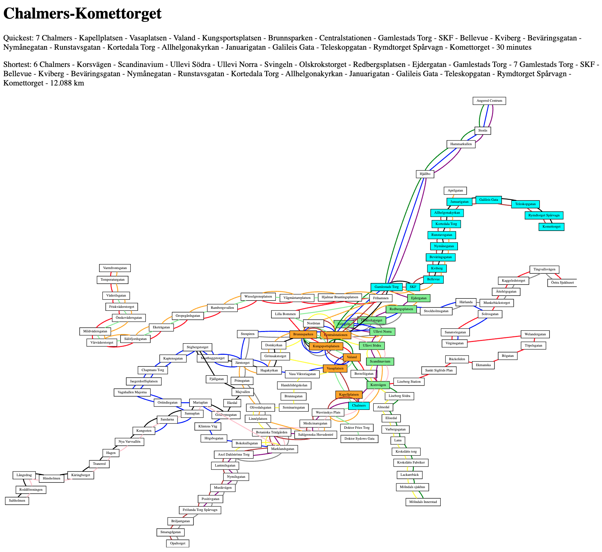

# Lab3: A web application for tram network

Advanced Python Course, Chalmers DAT515, 2021

by Aarne Ranta


Version 1.1, 8 December 2021: simplified the file structure a bit,
reflected in modifications in `files/tramviz.py, views.py`.

Version 1.0, 7 December 2021

NOTICE: if you have already started working in Flask, in accordance with the earlier draft, you can follow the specification in `flask-labd.md`.
The directories `static` and `templates` belong the the Flask version.
The actual task, including bonus parts, is the same.
But the instructions for Flask are less detailed, so we recommend the
Django version in this document. 

## Purpose

The purpose is to build a web application replicating some functionalities of apps such as [Västtrafik](https://www.vasttrafik.se/reseplanering/reseplaneraren/).
Your application will

- display the complete map of tram lines
- highlight shortest paths in terms of time and geographical distance
- bonus part 1: make the calculations more precise by taking changes into account
- bonus part 2: show actual departures from any stops by clicking at it on the map


Here is an example screenshot:



Unlike the official app, ours will not have access to the actual timetables, but just to the distances and times as defined in Labs 1 and 2.
This is of course a severe simplification - but, on the other hand,
our app will be usable for any transport system that can be
represented by the class `TramNetwork`.
In addition, the bonus part will give access to actual traffic information from Västtrafik.

Another difference from the official app is that we only run ours in a safe `localhost` environment.
Thereby we do not have to cope with security issues, and it will also be much easier for all groups to finish the project.

The learning outcomes include:

- visualization with more details on positions and colours
- simple front-end construction with HTML
- putting everything together by using a web application framework, Django
- more details of `graphviz` library, various libraries belonging to the `flask` framework
- virtual environments (`venv`)


The basic lab gives 10 points and each bonus part 4 points.
Thus the maximum is 18 points.


## The task

We will follow a standard line of work for the `django` network.
There are several tutorials available, for instance,

- [Django Girls Tutorial](https://tutorial.djangogirls.org/en/)
- [Official Django Tutorial](https://docs.djangoproject.com/en/3.2/intro/tutorial01/)


### Files to write

The final structure will look as follows.
The files are obtained as follows:

- created automatically (unmarked in the diagram).
- copied from [files](./files/) (marked `!!`).
- slightly modified from automatic files (marked `!`)
- explained in detail in text (marked `?`).
- written by you (marked `??`)
- generated by your code (marked `?!`)

```
lab3
├── db.sqlite3
├── manage.py
├── mysite
│   ├── __init__.py
│   ├── settings.py !
│   ├── urls.py !
│   └── wsgi.py
├── myvenv
│   └── ...
├── static
│   ├── tramnetwork.json ?!
│   └── tram-url.json ?!
└── tram
    ├── __init__.py
    ├── admin.py
    ├── apps.py
    ├── forms.py ?
    ├── migrations
    │   └── __init__.py
    ├── models.py ?
    ├── templates ?
    │   └── tram ?
    │      ├── find_route.html !!
    │      ├── home.html !!
    │      ├── images
    │      │   ├── gbg_tramnet.svg ?!
    │      │   ├── wikipedia_gbg_tramnet.svg !!
    │      │   └── shortest_path.svg ?!
    │      └── show_route.html !!
    ├── tests.py
    ├── urls.py ?
    ├── utils
    │   ├── __init__.py
    │   ├── graphs.py ?? 
    │   ├── trams.py ??
    │   └── tramviz.py ??
    └── views.py !!
```


## The Django workflow

If you have already created the project with copies of the provided files, you can go down to the section "TODO: continue from here".

The following steps must be taken at the first time:

1. create, if necessary, a directory for lab 3: `mkdir lab3`
2. move inside it: `cd lab3`
3. create a Python virtual environment: `python3 -m venv myvenv` or `python -m venv myvenv` if Python 3 is the only version of Windows you have installed
4. activate the virtual environment: `source myvenv/bin/activate` on Linux/Mac, `myenv/Scripts/activate.bat` on Windows
5. install the necessary Python library (`networkx` is only necessary if you did the baseline version of lab 2):
  ```
  pip install django
  pip install graphviz
  pip install networkx 
``` 
6. run `django-admin startproject mysite .`

At later times (every time you resume working on the project), only the `activate` step (4) is needed.

## Change default settings

In the generated `mysite/settings.py`, you need to change `ALLOWED_HOSTS` to
```
ALLOWED_HOSTS = ['127.0.0.1']
```
and add to the end

```
import os
STATIC_ROOT = os.path.join(BASE_DIR, 'static')
```
The `static` directory is needed for some files later, so create it now.
```
$ mkdir static
```


## Create database and test run

These steps are needed at the first time:

```
$ python manage.py migrate
$ python manage.py runserver
  Starting development server at http://127.0.0.1:8000/
```

The last command will start a server. Follow the URL to check if the installation succeeded.

## Create the tram app

```
$ python manage.py startapp tram
```
Then add the line
```
'tram.apps.TramConfig',
```
to the end of the `INSTALLED_APPS` list in `settings.py`.

### Create a model

Create a model for searched routes in `tram/models.py`:
```
from django.db import models

class Route(models.Model):
    dep = models.CharField(max_length=200)
    dest = models.CharField(max_length=200)

    def __str__(self):
        return self.dep + '-' + self.dest
```

Then you have to migrate it to the database:
```
$ python manage.py makemigrations tram
$ python manage.py migrate tram
```

### Update URL search patterns

Edit the generated `mysite/urls.py` so that it looks as follows:
```
from django.contrib import admin
from django.urls import path, include

urlpatterns = [
    path('admin/', admin.site.urls),
    path('', include('tram.urls')),
]
```
You have to create `tram/urls.py`:
```
from django.urls import path
from . import views

urlpatterns = [
    path('', views.tram_net, name='home'),
    path('route/', views.find_route, name='find_route'),
    ]
```


### Create views

In order for `tram/urls.py` to work, you have to create `tram/views.py`,
```
from django.shortcuts import render
from .forms import RouteForm

def tram_net(request):
    return render(request, 'tram/home.html', {})

def find_route(request):
    form = RouteForm()
    return render(request, 'tram/find_route.html', {'form': form})
```
The former function is already all we need to create the start page.
The latter function creates a web form, but does not yet do anything with it: we will return to this later.

Of course, we also need to define the ``RouteForm`` class and the HTML files.
This is the next topic.


### Create a form

In order for `tram/views.py` to work, we need to create `tram/forms.py`,
```
from django import forms
from .models import Route

class RouteForm(forms.ModelForm):
    class Meta:
        model = Route
        fields = ('dep', 'dest',)
```

### Create templates and static images

The HTML files to be created are actually **templates**, since they contain slots where dynamic data is pasted when the server is running.
The templates reside in a sub-sub-sub-directory, which has to be created first:
```
$ mkdir tram/templates
$ mkdir tram/templates/tram
```
Copy the HTML files mentioned in ``tram/views.py`` from the `files` folder to the newly created `tram/templates/tram`, so that
```
$ ls tram/templates/tram/
  find_route.html	home.html
```
Also create the `images` subdirectory:
```
$ mkdir tram/templates/tram/images
```
Then copy the Wikipedia tram network image `wikipedia_gbg_tramnet.svg` (also under `files`) there so that you can view the pages by running the server again,
```
$ python manage.py runserver
```
and opening `http://127.0.0.1:8000/` in a web browser.

*One of your tasks in this lab is to replace the Wikipedia image by an SVG file that you generate yourself. You will obviously also have to change the link to the SVG file in home.html.*


## Create dynamic content

The form `find_route.html` does not find any routes yet.
You can submit queries, but whn you press "Search", the form just gets empty without any result being produced.
One effect happens, though: stop names that you have entered are remembered, at least for some time, so that it is easier to select them again.

So now we want to create a baseline functionality that actually shows the shortest path.
The following things are needed:

- a "utility" function that actually calculates the shortest path (from your Lab 2)
- an extended `find_route()` function in `tram/views.py`
- a template that shows the route that is found


### Utility functions

It is a good practice to create a separate directory for "non-Django" utility functions and create an empty ``__init__.py`` file in it.
```
$ mkdir tram/utils
$ touch tram/utils/__init__.py
```
Copy the following given files into `tram/utils`:

- `graphs.py`, a mock-up, for the most part to be replaced by your Lab 2 version
- `trams.py`, a mock-up, for the most part to be replaced by your Lab 2 
- `tramviz.py`, with just some TODOs

### Views revisited

Now that you have created the utility files, you can replace the simplified `tram/views.py` with the one given in `files`.


## TODO: continue from here

Now it is "just" your part of the work that remains.
Most of this work is to be done in the files in `tram/utils`.
They contain `TODO` comments that instruct you what to do.

Links in `home.html` and `show_route.html` should also be changed to
your local files when you are able to generate them.
This is likewise explained in comments in these files.

How to create your own static picture `gbg_tramnet.svg` is explained
in `tramviz.py`: just set the color uniformly to white and make any
search.

You can of course also makes the HTML files look nicer if you have time!


## Bonus part 1

In Lab2 shortest path, we ignored the effect of changing from one line to the other.
This effect is that major factor that can make "shortest time" and "shortest distance" differ.
Its implementation requires that we recognize when a change must be made and add a suitable number of minutes or meters to the cost.

One way to do this with the existing algorithms is simply to build a new graph for the network, where

- vertices are pairs `(stop, line)` for each `stop` in the original graph and each `line` than passes through it,
- every edge `(a, b)` of the original graph is multiplied to edges `((a, line), (b, line))` for every `line` that serves both `a` and `b`,
- edges are added between all vertices that have the same `stop`,
- distances and transfer time between different stops are the same as in the original graph,
- a special change distance and change time is added between vertices that have the same stop but different times - for instance, 20 metres and 10 minutes, respectively.


## Bonus part 2: links to actual traffic information

This bonus part can be submitted even if you have not done Bonus part 1.

The challenge is to find the URLs corresponding to each stop name.
They are given as numerical codes, for instance, Nordstan is
```
https://www.vasttrafik.se/reseplanering/hallplatser/9021014004945000/
```
and its timetable is in
```
https://avgangstavla.vasttrafik.se/?source=vasttrafikse-stopareadetailspage&stopAreaGid=9021014004945000
```
The full list of stop identifiers can be found in
```
https://www.vasttrafik.se/reseplanering/hallplatslista/
```
The algorithm is as follows:

1. Investigate where and how Gids are given in the HTML document.
2. Extract the Gids of all tram stops from the document.
3. Create URLs for every stop.
4. Include the URLs in the generated map.

The standard library for parsing HTML is
```
https://docs.python.org/3/library/html.parser.html
```
A slightly more convenient third party library can also be used:
```
https://www.crummy.com/software/BeautifulSoup/bs4/doc/
```


## Submission

Via a GitHub link in Canvas, as usual.

Indicate in your Canvas message whether you claim bonus points for Bonus task 1 or 2 or both.


