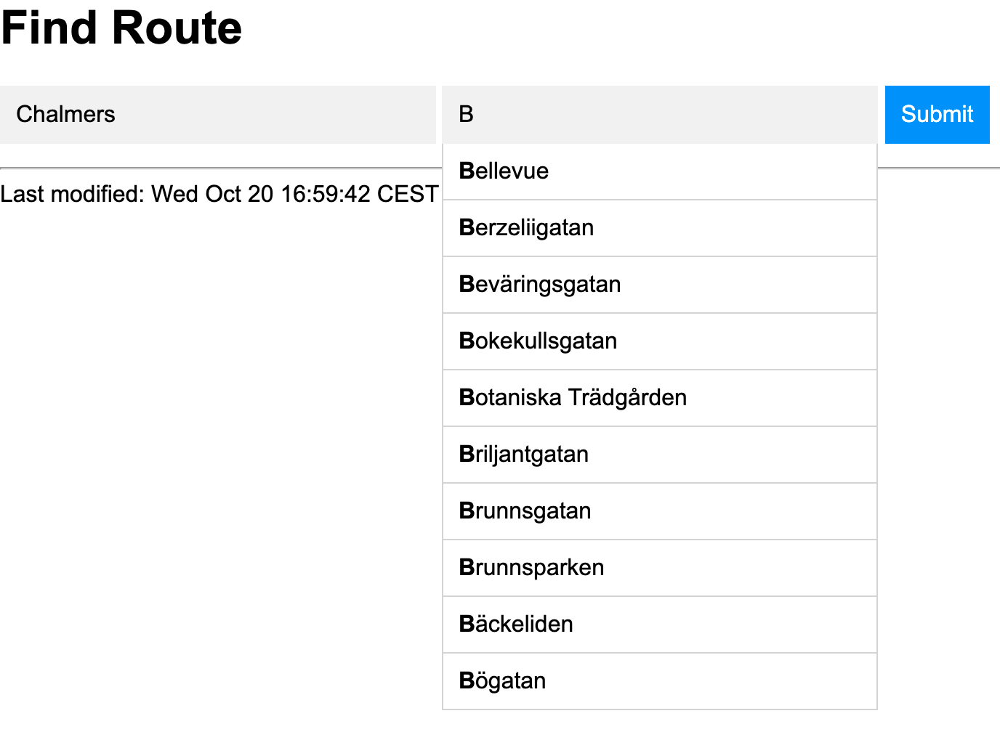

# Lab3: A web application for tram network

Advanced Python Course, Chalmers DAT515, 2021

by Aarne Ranta

## Purpose

The purpose is to build a web application replicating some functionalities of apps such as [Västtrafik](https://www.vasttrafik.se/reseplanering/reseplaneraren/).
Your application will

- display the complete map of tram lines
- highlight shortest paths in terms of time and geographical distance
- display a partial map with only a list of chosen lines

Here is an example screenshot:

Unlike the official app, ours will not have access to the actual timetables, but just to the distances and times as defined in Labs 1 and 2.
This is of course a severe simplification - but, on the other hand, our app will be usable for any transport system that can be represented by the class `TramNetwork`.

Another difference from the official app is that we only run ours in a safe `localhost` environment.
Thereby we do not have to cope with security issues, and it will also be much easier for all groups to finish the project.

The learning outcomes include:

- visualization with more details on positions and colours
- simple front-end construction with HTML, as well as external CSS and JavaScript
- putting everything together by using a webb application framework
- more details of `graphviz` library, various libraries belonging to the `flask` framework
- virtual environments (`venv`)

## The task

We will follow a standard line of work for the `flask` network.
There are several tutorials available, for instance, the one by [Miguel Grinberg](https://blog.miguelgrinberg.com/post/the-flask-mega-tutorial-part-i-hello-world), whose chapters 1 to 3 cover most of the things we need.

### The virtual environment

1. Create a `lab3` directory in your GitHub repository for the course.
2. Follow [the tutorial](https://blog.miguelgrinberg.com/post/the-flask-mega-tutorial-part-i-hello-world) to build a **virtual environment** (`venv`) for your application.
3. Activate the environment and install `flask` and other libraries that you need.

It is advisable to follow the tutorial, chapters 1 to 3, exactly before you start with your own project.
In this way, you can make sure that everything works as required.
But do not include this experiment in your course GitHub repository!

### Python files

Directly the `app` directory, you need to create the following files:

- `__init__.py`, standard
- `forms.py`, standard
- `routes.py`, standard
- `graphs.py`, a copy from Lab 2, with import paths set to `app` 
- `trams.py`, a copy from Lab 2, with import paths set to `app` 
- `tramnet.py`, a new file, where most of the work happens
- directory `static`, where you just copy
  - `auto.css` from [./static/]
  - `auto.js` from [./static/]
  - `tramnetwork.json` as created in Lab 1

- directory `templates`, where you put
  - `base.html` copied from [./templates/], inherited by most other pages
  - `route.html` copied from [./templates/], for searching for a route
  - `lines.html` which you create yourself, for just showing the network or restricting it to certain lines
  - `index.html` which you create yourself and where you can put whatever you want, but it must give links to `route.html` and `lines.html` 

Most part of the actual work will happen in ``tramnet.py``, which we will describe in a separate section.
However, you may actually spend much of your time just to make this all work so that you can see the app in action in your web browser.

### Changes to `trams.py`

The imports of Lab 2 files are now from their app versions:

    import json
    from app import graphs as g
    from urllib.request import urlopen

In `readTramNetwork()`, the JSON file is read from a URL, pointing to the `static` subdirectory of the app.
The URL that can be used is

    http://127.0.0.1:5000/static/gbg_trams.json

Instead of `open` on a file, the content is loaded by

    urlopen(url-of-tramfile).read().decode('utf8')

In order to position the stops well on the map, we need to know the extreme points of the network - that is, the minimum and maximum latitude and longitude.
To this end, we add a function (or a class method in `TramNetwork`)

    def extreme_positions(network):
        # code to compute the extreme positions
        return minlon, minlat, maxlon, maxlat

(TODO: The following is a bit complicated and might be given as extra.)

In Lab2 shortest path, we have ignored the effect of changing from one line to the other.
This effect is that major factor that can make "shortest time" and "shortest distance" differ.
Its implementation requires that we recognize when a change must be made and add a suitable number of minutes or meters to the cost.

One way to do this with the existing algorithms is simply to build a new graph for the network, where

- vertices are pairs `(stop, line)` for each `stop` in the original graph and each `line` than passes through it,
- every edge `(a, b)` of the original graph is multiplied to edges `((a, line), (b, line))` for every `line` that serves both `a` and `b`,
- edges are added between all vertices that have the same `stop`,
- distances and transfer time between different stops are the same as in the original graph,
- a special change distance and change time is added between vertices that have the same stop but different times - for instance, 20 metres and 10 minutes, respectively.

### The file `tramnet.py`

This is the file that makes most of the work in the app.
It imports three modules, the first two copied to app with modified paths:

   from app import graphs as g
   from app import trams as t
   import graphviz

Two functions are used in the app:

- `shortest(dep, dest)`, displaying the shortest path on the map
- `focused(lines)`, to display only the listed lines

A baseline implementation could use `graphs.visualize` from Lab 2.
But here we want more:

- the stops should be put into positions that correspond to their longitude and latitude;
- there should be separate, coloured edges for each tramline that serves the same edge;
- two possibly different shortest paths should be shown: the temporally and geographically shortest.

Moreover, there is a technical difference:

- the map should be generated in the SVG format (Scalable Vector Graphics) and piped directly to the app.

This, however, is easy to implement: as the last steps of visualization, use

    dot.format = 'svg'
    return dot.pipe().decode('utf-8')

The most complex part of this file - and the whole Lab 3 - is to make sure that the positions and colours come out right.
Here is a possible sequence of steps to follow:

- use `graphs.extreme_positions()` to compute the corners, the width, and the height of the map in geographic degrees;
- calculate `x` coordinates from *longitudes* by subtracting the minimal longitude from the actual longitude, and multiplying with a suitable constant (500 works well for me);
- calculate `y` coordinates similarly from latitudes;
- create a canvas of suitable size for the map, by for instance

    dot = graphviz.Graph(engine='fdp', graph_attr={'size': '12,12'})

which works fine for me (the engine 'fdp' is needed to preserve absolute positions);
- compute the shortest paths, with respect to both distance and time;
- print the nodes of the map, displaying the name of each tram stop and colouring it in three of different colours depending on if it appears on the shortest time path, shortest distance path, or both (see the picture at the beginning of this document, using yellow, cyan, and lightgreen, respectively);
- draw edges corresponding to each line with their colors - the following color map is an approximation of what is actually used

    {1: 'gray', 2: 'yellow', 3: 'blue', 4: 'green', 5: 'red',
     6: 'orange', 7: 'brown', 8: 'purple', 9: 'blue',
     10: 'lightgreen', 11: 'black', 13: 'pink'}

- print the listing of the quickest path and its duration, and the shortest (if different) and its length.

### Autocompletion

The route finding page helps users with autocompletion of tram stop names:

We provide ready-made Javascript and CSS files, given in the [static](./static) directory.
These files are copied and slightly modified from [W3Schools](https://www.w3schools.com/howto/howto_js_autocomplete.asp).
Since this kind of communication is not directly covered in Grinberg's tutorial, we also provide the HTML template file [route.html](./templates/route.html).

